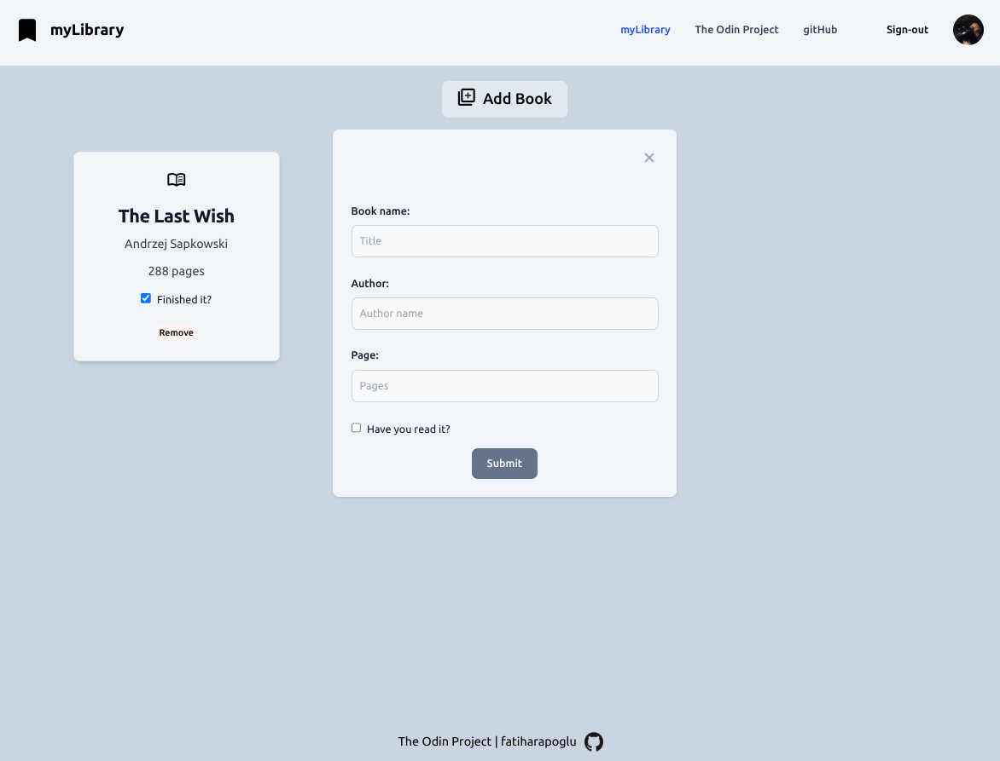

# Library

Created with **HTML**, vanilla **JavaScript** and **Tailwind CSS**.

Added **Firebase** support.

⮕ [Live preview](https://fatiharapoglu.github.io/library/)

## Features

-   Users can add, delete and update books.
-   Firestore database for saving books to access anywhere
-   Responsive design

## Helpers

-   [Tailwind CSS](https://tailwindcss.com/)
-   [Firebase](https://fonts.google.com/icons/) authorization for login and Firestore for database
-   [FontAwesome](https://fontawesome.com/) Icons

## How It Looks

